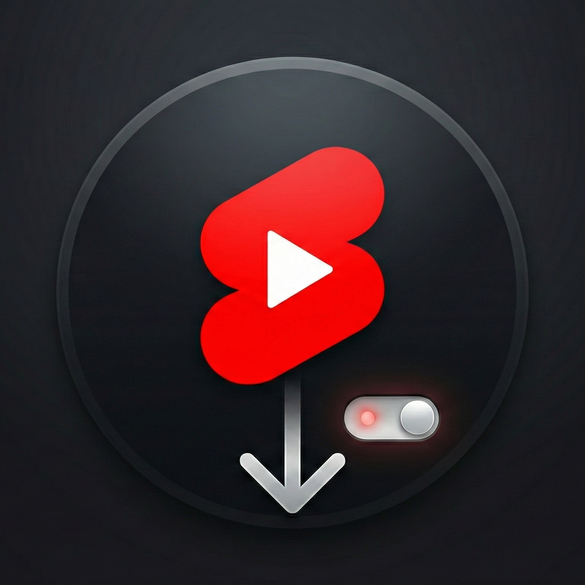
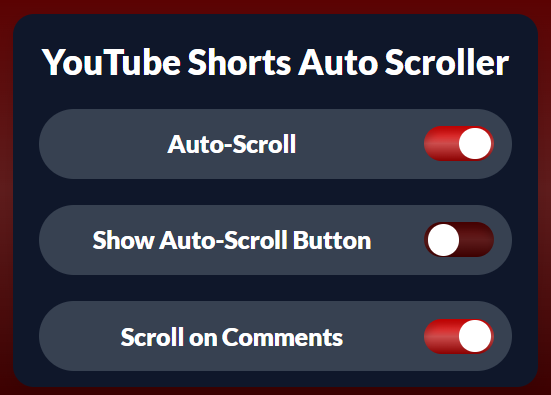

<div align="center">
  

  # Shorts Flow: Auto Scroll & Ad Skip
  
  **Experience YouTube Shorts Hands-Free!**
  
  [](https://opensource.org/licenses/MIT)
  [](manifest.json)
  [](https://developer.chrome.com/docs/extensions/mv3/)

  <p align="center">
    <b>Auto-scroll continuously, skip ads instantly, and never swipe again.</b><br />
    Perfect for eating, working, or multitasking. 🚀
  </p>
</div>

---

## � Overview

**Shorts Flow** is a powerful Chrome extension designed to enhance your YouTube Shorts viewing experience. It removes the need for manual interaction by automatically scrolling to the next video once the current one finishes. Whether you're busy with your hands or just want a seamless binge-watching session, Shorts Flow has you covered.

## ✨ Key Features

- **⏩ Smart Auto-Scroll**: Automatically detects when a Short ends and scrolls to the next one smoothly.
- **🚫 Instant Ad Skip**: Detects and skips ads immediately, so you never have to wait.
- **🕹️ Quick Toggle Button**: Adds a convenient on-screen button right above the 'Like' icon for easy control without opening the popup.
- **� Scroll with Comments**: Configurable option to continue auto-scrolling even when you have the comments section open.
- **🎨 Modern UI**: A sleek, user-friendly popup interface that looks right at home on YouTube.
- **⚡ Lightweight & Fast**: Optimized performance with minimal impact on browser resources.

---

## �️ Screenshots

<div align="center">
  
  <p><i>Clean and intuitive settings popup</i></p>
</div>

---

## 🛠️ Installation

Since this extension is currently in development/manual mode, you can install it by following these simple steps:

1.  **Clone or Download** this repository to your local machine.
    ```bash
    git clone https://github.com/yourusername/EXT-YouTube-Shorts-Auto-Scroller.git
    ```
    *(Or download the ZIP and extract it)*

2.  Open Google Chrome and navigate to **Extensions Management**:
    - Type `chrome://extensions/` in the address bar.
    - Or go to `Menu` > `Extensions` > `Manage Extensions`.

3.  Enable **Developer Mode** by toggling the switch in the top-right corner.

4.  Click the **Load unpacked** button that appears in the top-left.

5.  Select the folder where you downloaded/extracted this repository (the folder containing `manifest.json`).

6.  🎉 **Done!** The extension is now installed and active.

---

## 📋 Usage

### 1. The Popup Menu
Click the extension icon in your browser toolbar to open the settings menu.
- **Auto-Scroll**: Master switch to enable/disable the main functionality.
- **Quick Toggle**: Show/Hide the floating button on the YouTube interface.
- **Scroll with Comments**: Choose if scrolling should pause or continue when you're reading comments.

### 2. On-Screen Controls
If enabled, you'll see a small toggle button on the right side of the Shorts player (above the Like button).
- **Click it** to quickly pause or resume auto-scrolling without leaving full-screen mode.

---

## 🤝 Contributing

We welcome contributions from the community! If you have ideas for new features, bug fixes, or improvements, please feel free to help out.

### How to Contribute
1.  **Fork** the repository.
2.  Create a new **Branch** for your feature or fix (`git checkout -b feature/AmazingFeature`).
3.  **Commit** your changes (`git commit -m 'Add some AmazingFeature'`).
4.  **Push** to the branch (`git push origin feature/AmazingFeature`).
5.  Open a **Pull Request**.

> **Note**: Please ensure your code follows the existing style and conventions. All PRs will be reviewed before merging.

---

## 📄 License

This project is licensed under the **MIT License** - see the [LICENSE](LICENSE) file for details.

---

<div align="center">
  <sub>Built with ❤️ for YouTube Shorts lovers.</sub>
</div>
