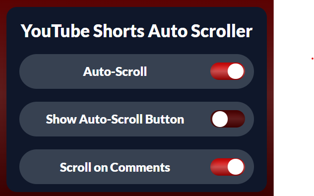

# YouTube Shorts Auto Scroller


## 🚀 Overview

**YouTube Shorts Auto Scroller** is a Chrome extension that lets you watch YouTube Shorts hands-free! Automatically scrolls to the next Short, so you can enjoy endless content while eating, working, or multitasking—no taps needed!

---

## ✨ Features

- ⏩ **Auto-scrolls** to the next YouTube Short
- 🕒 **Hands-free** experience for binge-watching
- ⚡ **Lightweight** and easy to use
- 🎨 Modern popup UI
- 🗂️ **Toggle to control auto-scroll with comments open**: Decide whether the extension should go to the next Short even when comments are open, giving you more control over your viewing experience.

---

## 📦 File Structure

```
├── icons/                # Extension icons
│   ├── icon16.png
│   ├── icon48.png
│   ├── icon128.png
│   └── Main.png
├── popup/                # Popup UI
│   ├── popup.html
│   └── popup.css
├── scripts/              # Main extension scripts
│   ├── background.js
│   ├── content.js
│   └── script.js
├── manifest.json         # Extension manifest
└── README.md             # This file
```

---

## 🛠️ Installation

1. **Clone or Download** this repository.
2. Go to `chrome://extensions/` in your browser.
3. Enable **Developer mode** (top right).
4. Click **Load unpacked** and select this project folder.
5. Enjoy hands-free YouTube Shorts!

---

## 📋 Usage

- Click the extension icon in your browser.
- Use the popup to start or stop auto-scrolling.
- Adjust settings as needed (future updates).

---

## 🖼️ Screenshots

> 

---

## 🤝 Contributing

Pull requests and suggestions are welcome! Feel free to open an issue or submit a PR.

---

## 📄 License

MIT License. See [LICENSE](LICENSE) for details.
